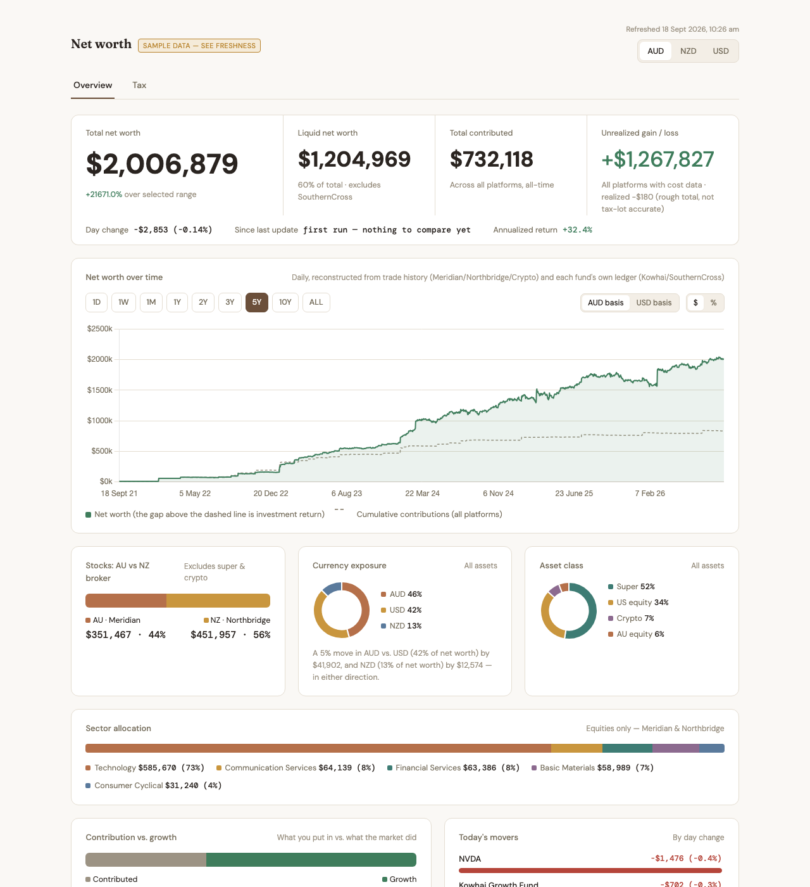
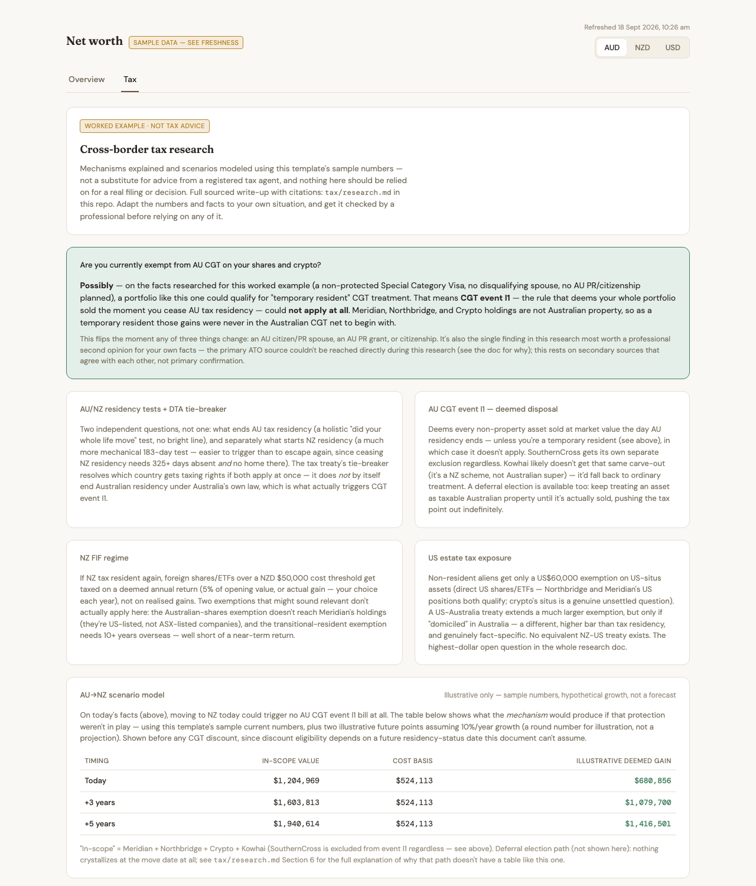
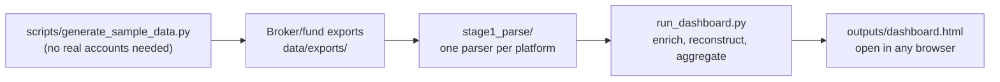

# Net Worth Dashboard

A local pipeline that turns your broker, fund, and crypto-wallet exports into a
single self-contained net-worth dashboard: total net worth over time (reconstructed
from real transaction history, not just periodic snapshots), platform and holding
breakdowns, currency and asset-class composition, benchmark comparison, fee tracking,
annualized returns, and a worked example of researching a real cross-border tax
question against your own numbers.




## Why this exists

Before this existed, tracking real net worth across several accounts meant manually
converting currencies, manually reconciling which platform held what, and trusting
whatever number you last typed into a spreadsheet. This pipeline does it
automatically, and reconstructs the *history* too — not just today's snapshot, but a
real daily net-worth chart going back to whenever each account actually started,
built from real transaction and ledger data.

**This repo is a template, not a portfolio piece with the names swapped.** Everything
here — the pipeline architecture, the parsing patterns for two different kinds of
export (transaction logs vs. running-balance ledgers), the historical-value
reconstruction, the tax-research approach — is built around five *fictional*
platforms so it can ship publicly with zero real financial data. But none of the
*mechanics* are specific to those five platforms. The pattern (parse a real export
into a common shape → enrich with live prices → reconstruct daily history → aggregate
today's snapshot → render one dashboard) carries over directly to your own real
broker, your own real KiwiSaver/401(k)/super fund, your own real crypto wallet —
what's platform-specific lives entirely in `pipeline/stage1_parse/`, one file per
platform. Adapting this to your own real accounts means writing a new parser file, or
editing an existing one to match your own export's actual columns — not starting from
scratch. See ["Adapting this to your own platforms"](#adapting-this-to-your-own-platforms)
below.

## How it works



Two ways data gets into `data/exports/`: your own real exports from your own real
platforms, or the synthetic generator (`scripts/generate_sample_data.py`) if you're
just trying the template out first. Either way, `run_dashboard.py` reads whatever's
in `data/exports/`, enriches it with live public market prices, reconstructs a full
daily history, and writes one self-contained `outputs/dashboard.html` — that's the
entire pipeline. See [`docs/02-technical-documentation.md`](docs/02-technical-documentation.md)
for the full script-by-script breakdown, including the exact internal call order.

## Requirements

- Python 3.11+
- [uv](https://docs.astral.sh/uv/) for dependency management (or plain `pip` with the
  dependencies in `pyproject.toml`)
- No accounts, no API keys, no signup — the synthetic-data quickstart needs nothing
  but Python. Using your own real data needs whatever export files your own
  broker/fund/wallet already lets you download.

## Try it in 60 seconds

The repo ships a synthetic data generator so you can see the whole pipeline run
before connecting anything real:

```bash
git clone https://github.com/DylanBai4028/investing-dashboard-template.git
cd investing-dashboard-template
uv venv .venv
uv pip install --python .venv/bin/python -r pyproject.toml
.venv/bin/python scripts/generate_sample_data.py
.venv/bin/python pipeline/stage2_generate/run_dashboard.py
open outputs/dashboard.html
```

That generates a fictional ~$2,000,000 AUD portfolio across five fictional platforms
(a broker, a second broker, a self-custody crypto wallet, a KiwiSaver-style fund, and
a super fund) and runs the real pipeline against it — the exact same code path real
data would go through, just with made-up holdings. Every dollar figure, ticker, and
platform name in the sample data is fictional; only the public market prices
(fetched live from Yahoo Finance) are real.

## Project structure

```
investing-dashboard-template/
├── outputs/                        generated dashboard — gitignored, rebuilt every run
│   └── dashboard.html
├── data/                           source data only — nothing generated lives here
│   ├── manual_holdings.yaml        for any manual-only asset (empty by default)
│   ├── exports/                    gitignored — your real exports, or generated sample ones
│   └── cache/                      gitignored — cached price history, safe to delete
├── pipeline/
│   ├── stage1_parse/                  one parser per platform
│   │   ├── parse_meridian.py             AU-broker-style multi-sheet XLSX exports
│   │   ├── parse_northbridge.py          NZ-broker-style single CSV
│   │   ├── parse_crypto.py               Yahoo Finance crypto-portfolio CSV
│   │   ├── parse_kowhai.py               NZ-fund-style running-balance ledger CSV
│   │   └── parse_southerncross.py        AU-super-style per-financial-year CSVs
│   ├── stage2_generate/
│   │   └── run_dashboard.py           the one script you actually run
│   ├── lib/                           shared code the parsers and the generator both use
│   │   ├── config.py                     constants, asset-class rules
│   │   ├── prices.py                     live + historical price/FX fetching
│   │   ├── schema.py                     the shared transaction shape
│   │   ├── history.py                    reads data/manual_holdings.yaml
│   │   ├── backfill.py                   reconstructs daily net worth
│   │   └── aggregate.py                  builds today's snapshot
│   └── templates/
│       └── dashboard.html.j2          the dashboard's own HTML/CSS/JS
├── scripts/
│   └── generate_sample_data.py     writes fictional exports into data/exports/
├── tax/
│   └── research.md                 worked cross-border tax research example
├── docs/
│   ├── 01-overview.md / .html      plain-language walkthrough
│   └── 02-technical-documentation.md  script-by-script technical reference
├── LICENSE
├── pyproject.toml
└── README.md                       this file
```

## Adapting this to your own platforms

Every real platform's export format is different, but this template already covers
the two shapes almost anything you'll encounter falls into — see
[`docs/02-technical-documentation.md`](docs/02-technical-documentation.md#adding-a-sixth-platform)
for the full guide. In short:

**It reports individual trades** (like a typical share broker): write a new
`pipeline/stage1_parse/parse_<yourplatform>.py` that reads your real export and
returns a DataFrame matching the shared transaction shape (`date, platform, ticker,
type, quantity, price, currency` — see `pipeline/lib/schema.py`). Add it to
`run_dashboard.py`'s `load_transactions()`. The reconstruction, the rollups, and the
dashboard's drill-down all work automatically from there, since they operate on that
shared shape, not on anything platform-specific.

**It reports a running balance, not trades** (like most KiwiSaver/401(k)/super
funds): write a parser exposing `parse_daily_balance()`, `parse_contributions()`,
`daily_aud_series(date_range)`, and `daily_contributed_aud_series(date_range)` in the
same shape `parse_kowhai.py`/`parse_southerncross.py` already use. Add a call to
`_ledger_platform()` in `run_dashboard.py` alongside the existing two.

Either way: check `pipeline/lib/config.py`'s `ILLIQUID_PLATFORMS` (is the new
platform's balance actually accessible on demand?) and `classify_asset_class()`/
`ASSET_CLASS_OVERRIDES` (is its holding-level asset class inferred correctly?) before
trusting the new platform's numbers in the composition views.

Once your own real data is wired in, delete `data/exports/`'s generated sample files
and drop your own real exports there instead — nothing else in the pipeline needs to
change, and `data/exports/`/`data/cache/` are already gitignored so your real data
never gets committed by accident.

## Privacy, if you use this with your own real data

- **Nothing here connects live to any account.** Every platform's data arrives as a
  file you export by hand and drop into `data/exports/` — there's no API key, no
  stored login, no OAuth connection this pipeline holds to anything.
- **The dashboard is a single local HTML file.** Nothing about this pipeline
  publishes or hosts it anywhere — you open it locally, and it's your choice entirely
  whether it ever leaves your machine.
- **`data/exports/` and `data/cache/` are gitignored by default** specifically so a
  real export never gets committed by accident once you're using your own data.
- **The only outbound network calls the pipeline makes are for public market prices**
  (stock/crypto/FX/benchmark index data from Yahoo Finance) — no personal or account
  information is ever part of those requests.

## License

MIT — see [LICENSE](LICENSE).
