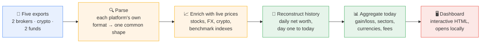
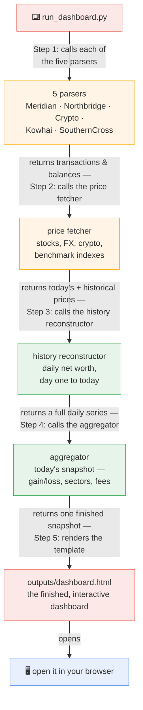

# How This Works: A Net-Worth Dashboard Template

A plain-language walkthrough of a working system: pulling holdings and transaction
history from five separate accounts, across three currencies, into one dashboard that
shows what you actually own, what it's actually worth today, and — as a worked
example — what it would actually cost in tax if you moved between two countries.
Everything in this repo runs against fictional sample data by default; the same
pipeline runs against your own real accounts once you swap in your own exports.

This document doesn't assume any technical background. For how the code itself
works, see [`02-technical-documentation.md`](02-technical-documentation.md).

## The problem this solves

Tracking real net worth across several accounts normally means manually converting
currencies, manually reconciling which platform holds what, and trusting whatever
number you last typed into a spreadsheet. This pipeline does it automatically, and
reconstructs the *history* too — not just today's snapshot, but a real daily
net-worth chart going back to whenever each account actually started, built from real
transaction and ledger data, not estimated.

## The pipeline at a glance



Each stage produces something that can be opened and checked before trusting the next
one — nothing happens in one giant, opaque step.

## How it's actually run: one command, one script, five helpers

Nothing here needs opening a Python file or running five separate programs by hand.
Every stage above happens automatically, in order, from two commands:

```
python scripts/generate_sample_data.py       # skip this if using your own real data
python pipeline/stage2_generate/run_dashboard.py
```

The second command does the real work: it runs one Python script
(`run_dashboard.py`), which writes `outputs/dashboard.html`. Everything else — all
five stages above — happens *inside* that one script's run, because
`run_dashboard.py` directly calls the other pieces of code as part of doing its job —
the way a manager delegates a task to five specialists, then assembles their work
into one result:



The data carries through as real values, not files handed between separate
programs — one process, start to finish, triggered by one command.

## Walking through each stage

### 1. Export — real files, from real accounts (or generated sample ones)

Each platform is periodically exported by hand: Meridian and SouthernCross as
spreadsheets (one per financial year), Northbridge and Kowhai as a single CSV
covering full history, Crypto via a Yahoo Finance portfolio export.
`scripts/generate_sample_data.py` writes fictional files in these exact formats so
the quickstart works with no real accounts at all. Nothing connects live to any real
account — there's no API key, no login the dashboard holds. A fresh export just gets
dropped into `data/exports/`, and `run_dashboard.py` picks it up next time it runs.

### 2. Parse — five different formats, one common shape

Each platform's export gets its own parser, because every one of them is genuinely
different: a typical broker reports trades, dividends, and deposits as separate
report types; another broker exports one combined CSV; the two fund-style platforms
don't report individual trades at all — they report a running dollar balance, since
they're fund accounts, not brokerage accounts. `run_dashboard.py` calls all five
directly, one after another, and each one hands back data in one of two common
shapes: a transaction log or a daily balance ledger.

### 3. Enrich with live prices

Every holding gets today's market price, plus a full price history back to when it
was first bought — stocks, crypto, and the AUD/USD/NZD exchange rates needed to
convert everything into one reporting currency, all from Yahoo Finance's public data.
Prices are cached locally so re-running the dashboard doesn't re-download years of
history every time.

### 4. Reconstruct history — a real chart, not a guess

This is what makes the net-worth-over-time chart meaningful from day one, rather than
only useful after years of manually saved snapshots: given the full transaction
history and the full price history, the daily value of every holding on every day
since it was bought can be *calculated*, not estimated. The chart showing years of
net-worth history exists because the underlying trade data does.

### 5. Aggregate today's snapshot

Everything gets rolled up into today's numbers: total net worth, contributed capital
versus market growth, gain/loss by platform, sector and currency exposure, dividend
income, fees paid, and an annualized (money-weighted) rate of return — both for the
whole portfolio and broken out per platform, since blending several very different
accounts into one average return hides more than it shows.

### 6. Dashboard — the finished, interactive output

One HTML file, opened locally in a browser — a net-worth chart with range and
currency toggles, a platform-by-platform breakdown, a treemap and ranked list of
every holding, and a second tab with a worked cross-border tax example. Everything on
it traces back to a real number from a real (or generated sample) export; nothing is
a placeholder.

## Where AI was involved, and where it wasn't

Worth being precise about, since it's a different shape than "AI reads your
documents every time it runs," which is how some automated pipelines use AI:
**nothing in this pipeline calls an AI model at runtime.** Every parser, every
calculation, every chart is ordinary, deterministic Python — pandas doing arithmetic,
not a model making a judgment call. The dashboard produces the exact same numbers
whether or not an AI model exists.

This template — the pipeline, the parsers, the tax research methodology — was built
with Claude (Anthropic's AI), across many sessions, from plain-language requests.
That's a meaningfully different use of AI than having it read documents in the
pipeline's critical path every time it runs — closer to "AI as the person who wrote
the code" than "AI as a step the code depends on."

## How the pipeline checks its own work

Every number on the dashboard is either read directly from an export or calculated
from one — nothing is estimated or filled in as a placeholder. A few specific
safeguards are built directly into the pipeline, not left to a manual check after the
fact:

- **Meridian's own reconstructed holdings are cross-checked against Meridian's own
  independent point-in-time valuation snapshot**, every single run — an internal
  consistency check between two different reports the same platform provides, not
  just "did the code finish without an error."
- **Every historical currency conversion uses that specific date's own exchange
  rate**, never today's rate applied to a past value — this is what makes the
  dashboard's USD-basis toggle show a genuinely different return curve, not just a
  rescaled version of the AUD one.
- **Ambiguous or genuinely uncertain data is flagged and documented explicitly**,
  rather than silently resolved one way or another — the clearest example is a
  fund-style platform that blends a locked and a freely-withdrawable portion in one
  balance with no way to separate them from the export alone; the dashboard says
  exactly what it's approximating there, rather than presenting a guess as fact.

## Privacy and where your data lives

- **Nothing connects live to any account.** Every platform's data arrives as a file
  you export by hand and drop into a folder — there's no API key, no stored login, no
  OAuth connection this dashboard holds to anywhere.
- **Never published, never hosted, by design.** The dashboard is a single HTML file
  you open locally. This pipeline has no code path that publishes or uploads
  anything — what you do with the output file afterward is entirely up to you.
- **`data/exports/` and `data/cache/` are gitignored** specifically so a real export
  never gets committed by accident once you're using your own data.
- **The only outbound network calls the pipeline makes are for public market prices**
  (stock/crypto/FX/benchmark index data from Yahoo Finance) — no personal or account
  information is ever part of those requests.

## Project structure

```
investing-dashboard-template/
├── outputs/                        generated dashboard — gitignored, rebuilt every run
│   └── dashboard.html
├── data/                           source data only — nothing generated lives here
│   ├── manual_holdings.yaml        for any manual-only asset (empty by default)
│   ├── exports/                    gitignored — your real exports, or generated sample ones
│   │   ├── MERIDIAN_INVESTMENT_ACTIVITY_....xlsx
│   │   ├── northbridge-markets-transactions-report-....csv
│   │   ├── yahoo-crypto-portfolio.csv
│   │   ├── Kowhai-transactions.csv
│   │   └── SouthernCross.MemberTransactions.FY....csv
│   │       (…one file set per financial year for Meridian/SouthernCross)
│   └── cache/                      gitignored — cached price history, safe to delete
│       └── AAPL.parquet  (…one file per ticker/FX pair/benchmark index)
├── pipeline/                       all the code
│   ├── stage1_parse/                  one parser per platform
│   │   ├── parse_meridian.py
│   │   ├── parse_northbridge.py
│   │   ├── parse_crypto.py
│   │   ├── parse_kowhai.py
│   │   └── parse_southerncross.py
│   ├── stage2_generate/               the one script you actually run
│   │   └── run_dashboard.py
│   ├── lib/                           shared code the parsers and the generator both use
│   │   ├── config.py                     constants, asset-class rules
│   │   ├── prices.py                     live + historical price/FX fetching
│   │   ├── schema.py                     the shared transaction shape
│   │   ├── history.py                    reads data/manual_holdings.yaml
│   │   ├── backfill.py                   reconstructs daily net worth
│   │   └── aggregate.py                  builds today's snapshot
│   └── templates/
│       └── dashboard.html.j2          the dashboard's own HTML/CSS/JS
├── scripts/
│   └── generate_sample_data.py     writes fictional exports into data/exports/
├── tax/
│   └── research.md                 worked cross-border tax research example
├── docs/                           this document (with an HTML version) and the technical one
│   ├── 01-overview.md / .html
│   ├── 02-technical-documentation.md
│   ├── sample-dashboard.html       pre-built dashboard, open directly, no setup
│   └── images/                     README screenshots
├── LICENSE
├── pyproject.toml                  Python dependencies
└── README.md
```

## What this gives you

The dashboard answers the question this template is built around — "what do I
actually own, what is it actually worth, and what would a real cross-border move
actually cost me in tax" — with real numbers instead of a guess, once you've wired in
your own real accounts. The tax research behind the Tax tab (see `tax/research.md`
for the full sourced version) is a worked example of exactly that: research the
mechanism, model the scenario against your own real numbers, and get anything with
real dollars attached checked by an actual professional before relying on it.

Every design choice here follows the same handful of principles: never guess a
number that can be calculated from real data, never silently merge or drop something
that turns out to be ambiguous (flag it explicitly instead), cross-check against an
independent source whenever one exists, and keep tax research clearly separated from
tax advice.
