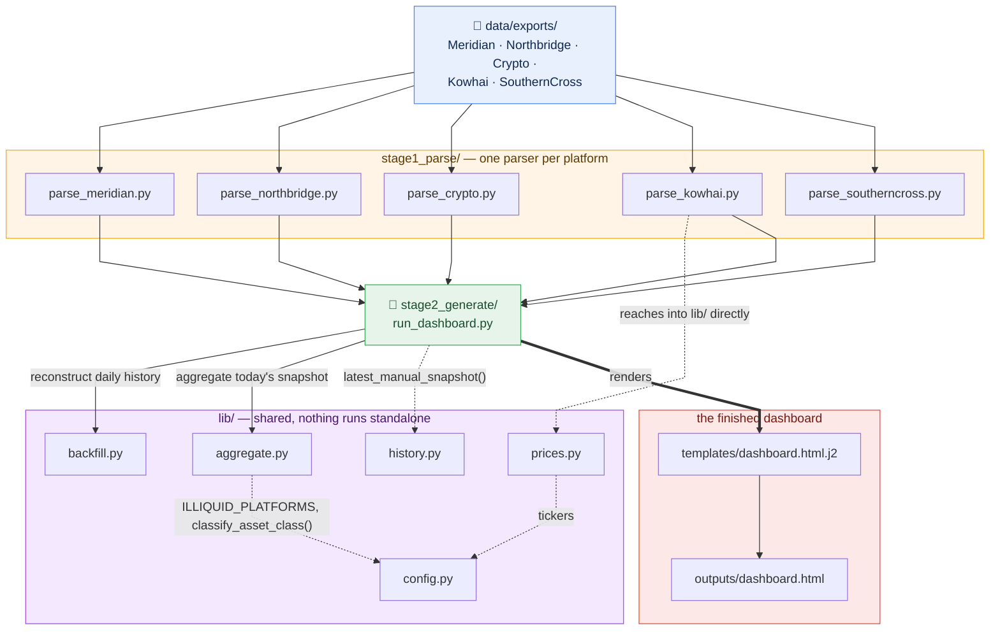
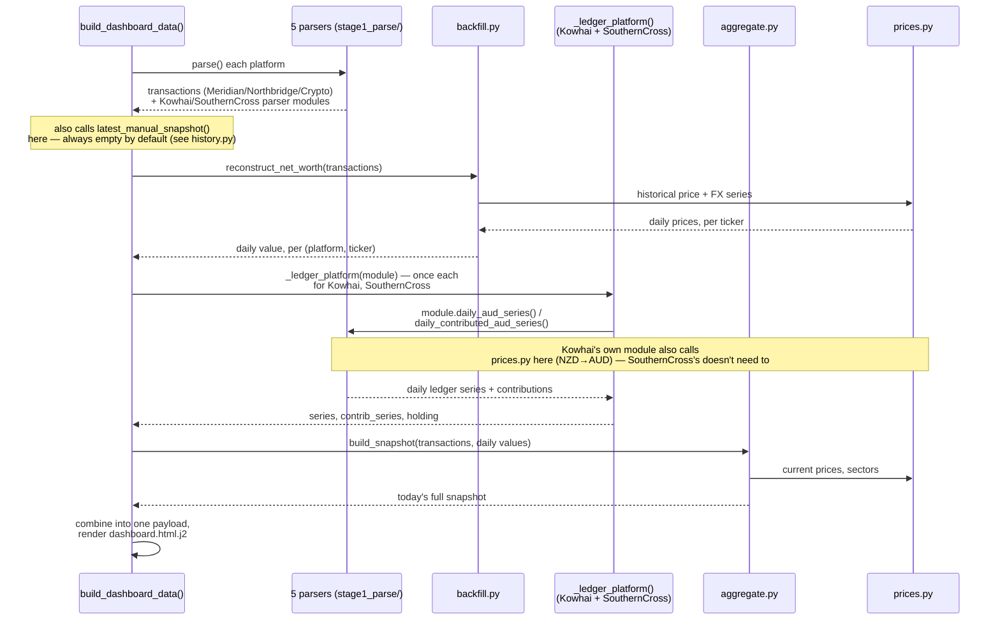
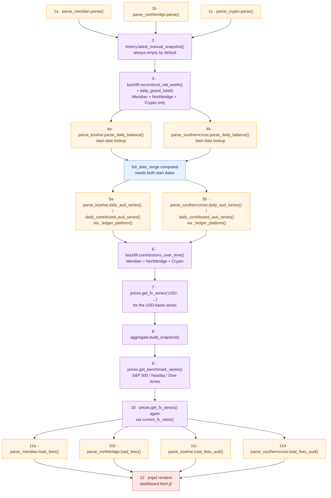

# Technical Documentation

How the pipeline's scripts work and relate to one another. For a plain-language
walkthrough of what the dashboard does and why, see
[`01-overview.md`](01-overview.md) — this document assumes you're comfortable reading
Python. For the full project file tree, see that document's "Project structure"
section rather than duplicating it here.

## Contents

- [Environment](#environment)
- [Running it](#running-it)
- [Architecture at a glance](#architecture-at-a-glance)
- [Why `stage1_parse/` / `stage2_generate/` / `lib/` exist](#why-stage1_parse--stage2_generate--lib-exist)
- [`run_dashboard.py`'s internal call sequence](#run_dashboardpys-internal-call-sequence)
- [Every import, in the order it's touched](#every-import-in-the-order-run_dashboardpy-actually-touches-it)
- [Script-by-script](#script-by-script)
- [Data schema](#data-schema)
- [Cost and scaling](#cost-and-scaling)
- [Patterns used throughout](#patterns-used-throughout-worth-knowing-before-extending-this)
- [Adding a sixth platform](#adding-a-sixth-platform)
- [Known limitations](#known-limitations)

## Environment

- Python 3.11+, managed with `uv` (`.venv` in the project root).
- Dependencies in `pyproject.toml`: `pandas` + `pyarrow` (data handling, parquet price
  cache), `yfinance` (stock/FX/crypto/benchmark price history), `pyyaml` (manual-asset
  config), `jinja2` (renders the dashboard template), `openpyxl` (reads Meridian's XLSX
  exports), `python-calamine` (the actual Excel *engine* used for Meridian — real
  broker XLSX exports sometimes carry a stylesheet `openpyxl`'s own reader rejects
  outright; calamine reads them fine regardless).
- No secrets, no API keys, no `.env` file — every price source is Yahoo Finance's
  public, unauthenticated data. The only "credentials" this project has are the raw
  export files themselves (`data/exports/`, gitignored, never committed).

## Running it

```
python scripts/generate_sample_data.py
python pipeline/stage2_generate/run_dashboard.py
open outputs/dashboard.html
```

The first command is only needed once, or whenever you want fresh sample data — skip
it entirely once you're using your own real exports. Each of the five parsers in
`stage1_parse/` also has its own `if __name__ == "__main__":` block, runnable
standalone (`python pipeline/stage1_parse/parse_meridian.py`) for smoke-testing one
platform's parser in isolation, without running the full pipeline.

## Architecture at a glance

Arrows point from caller to callee throughout — `run_dashboard.py` (`RD`) calls into
`backfill.py`/`aggregate.py`/`history.py`, so the arrows start at `RD` and point at
them, not the other way around. That's the standard convention for this kind of
diagram (same one the call-sequence diagram below uses, just without a separate
return arrow): the arrowhead marks what gets called.

<div align="center">



</div>

This is deliberately the high-level picture only — which folder calls into which,
what `run_dashboard.py` calls directly, and two of the scripts that read `config.py`.
It leaves out two things on purpose, to keep it readable rather than a tangle of
crossing lines: `backfill.py` and `aggregate.py` both also call into `prices.py` for
price/FX data, and `run_dashboard.py` itself also reads `config.py` directly
(`FX_TICKERS`, `ILLIQUID_PLATFORMS`), not just through `prices.py`/`aggregate.py` —
both still true, just not drawn here, since neither changes which folder owns what,
and the two diagrams below already show the real call order in full.

`schema.py` isn't in this diagram either — it's never imported by the real pipeline
(only by each `__main__` block's own smoke test, and by the parsers' docstrings as a
documented convention), so it has no real edges to draw. See "Data schema," below.

`run_dashboard.py` is the only real entry point. It imports every parser in
`stage1_parse/` and every module in `lib/` directly as Python modules (not subprocess
calls) and calls their functions itself, in the order described below — this is one
process from start to finish, not five separate programs handing files to each other.

## Why `stage1_parse/` / `stage2_generate/` / `lib/` exist

The folders map directly onto the pipeline's real shape: `stage1_parse/` (the five
parsers — turn an export into a common transaction/ledger shape), `lib/` (shared code
nothing runs standalone — price fetching, config, the backfill/aggregate
calculations), and `stage2_generate/` (the one orchestrator, `run_dashboard.py`, that
calls everything else and produces the actual output).

The folder names encode run order (`stage1_` before `stage2_`) deliberately, in place
of numeric filename prefixes (`01_parse_meridian.py`) — **a filename starting with a
digit isn't a valid Python module name**, so a numbered-file approach would break
every plain `import parse_meridian` statement throughout the codebase. `stage1_`/
`stage2_` are ordinary, importable identifiers that read the same way.

**The mechanics, concretely**: `run_dashboard.py` lives one directory deeper than
`pipeline/` itself (`pipeline/stage2_generate/`), so Python's default behaviour —
auto-adding only the running script's own directory to `sys.path` — doesn't put
`stage1_parse/` or `lib/` on the import path automatically. The first lines of
`run_dashboard.py`, right after `from __future__ import annotations`, add both
explicitly:

```python
_PIPELINE_DIR = Path(__file__).resolve().parent.parent  # pipeline/
sys.path.insert(0, str(_PIPELINE_DIR / "lib"))
sys.path.insert(0, str(_PIPELINE_DIR / "stage1_parse"))
```

Every import after that bootstrap (`import parse_meridian`, `from config import ...`,
etc.) is completely ordinary and unqualified. The only other file needing this is
`parse_kowhai.py`, the one parser that itself imports from `lib/` (`from prices
import get_fx_series`, for its own NZD→AUD conversion) — it carries the same two-line
bootstrap so its own standalone smoke test resolves the import correctly too.

## `run_dashboard.py`'s internal call sequence



In prose: `build_dashboard_data()` first collects every platform's raw data (the five
`parse()` calls), then reconstructs a full daily history for the transaction-based
three via `backfill.py`, computes Kowhai's and SouthernCross's own daily ledger series
via a shared `_ledger_platform()` helper, sums everything into one combined net-worth
series (including a USD-basis version, each day re-expressed using that day's own
historical AUD/USD rate), computes an annualized return both portfolio-wide and
per-platform, and finally calls `aggregate.py` to build today's snapshot —
platform/sector/currency rollups, fees, dividends. Everything gets assembled into one
JSON payload and handed to `templates/dashboard.html.j2` via Jinja2.

## Every import, in the order `run_dashboard.py` actually touches it

The diagram above groups calls by collaborator and shows their returns. This one
flattens that into a single timeline instead — every distinct call
`build_dashboard_data()` (and `render()`) makes into one of its own imports, in the
literal order they happen, including every repeat visit to the same module. Steps
sharing a number (`1a`/`1b`/`1c`, for example) don't depend on each other's results —
nothing here actually runs on more than one thread, Python executes them one after
another regardless, but there's no data dependency forcing that order, so they're
drawn side by side rather than implying a false chain. Two things this makes visible
that the diagram above doesn't:

- **Meridian, Northbridge, and Crypto are parsed first and run through `backfill.py`
  immediately.** Kowhai and SouthernCross aren't touched until several steps later,
  and go through a completely different function (`_ledger_platform()`), never
  `backfill.py` — they're fundamentally two different kinds of data (transactions vs.
  a dollar ledger), and the call order reflects that split.
- **`prices.py` gets called from three separate, unrelated places** — the USD-basis
  series, the benchmark comparison, and the live FX-rate display — not from one clean
  step. It's woven through the function, not a single stage.

<div align="center">



</div>

`config.py` doesn't appear here either, for the same reason it's missing from the
architecture diagram above: nothing calls it. Its constants (`FX_TICKERS`,
`ILLIQUID_PLATFORMS`) are just read wherever they're needed — inside several of the
numbered steps above, not as a step of their own.

## Script-by-script

### `stage1_parse/parse_meridian.py`

Parses five report types per financial year, all prefixed `MERIDIAN_` —
`INVESTMENT_ACTIVITY` (trades, in separate "Aus Equities"/"Wall St Equities" sheets),
`INVESTMENT_INCOME` (dividends, same sheet split), `CASH_TRANSACTION` (deposits —
the real "total contributed" source, not inferred from trade cost),
`PORTFOLIO_VALUATION` (a point-in-time holdings snapshot, used as a cross-check
against the reconstructed holdings, not as a data source itself), and
`OTHER_ACTIVITY` (transfers/corporate actions, unused by this template). Cost basis
uses `Total Value / Units`, not `Avg. Price` — `Total Value` already folds in fees
and GST.

`cross_check_against_valuation()` compares the reconstructed holdings (built purely
from `INVESTMENT_ACTIVITY`) against the platform's own independent
`PORTFOLIO_VALUATION` snapshot, every time this parser runs — an internal consistency
check between two different reports the same platform provides.

### `stage1_parse/parse_northbridge.py`

Parses one combined CSV covering full transaction history. Handles a real-world
stock split (`apply_split_adjustments()` multiplies quantity and divides price for
every trade dated before a split, chained in chronological order across multiple
splits on the same ticker) and a real-world symbol rename (`SYMBOL_RENAMES`, mapping
an old ticker to its current one) — the sample data reuses NVIDIA's real 2024 10:1
split and Facebook's real 2022 rename to Meta, since those are genuine public market
history, not personal information, and a realistic way to exercise both code paths.

### `stage1_parse/parse_crypto.py`

Parses a Yahoo Finance crypto-portfolio CSV export — already in a per-trade,
yfinance-compatible ticker format (`BTC-USD`, etc.), so this is the simplest of the
five parsers, needing no split-adjustment or rename logic.

### `stage1_parse/parse_kowhai.py`

Parses a running dollar-balance ledger (`[Date, Transaction details, debits, Credits,
Balance]`, newest-row-first), not individual trades — the `Balance` column is
already a running total, so no price/quantity reconstruction is needed the way stock
holdings require. `CONTRIBUTION_TYPES` splits ledger rows into real new-capital
contributions versus investment earnings/tax/fees.

### `stage1_parse/parse_southerncross.py`

Parses per-financial-year member-transaction CSVs. Unlike Kowhai's ledger, there's
no running-balance column — the daily balance is reconstructed as a cumulative sum of
each transaction's `Total Amount`, excluding "Investments - Member Direct transfer"
rows (internal moves into the fund's own self-managed option, not money leaving the
fund).

### `lib/config.py`

Shared constants and one classification helper — no real data lives here, only
rules. `FX_TICKERS`/`BENCHMARK_TICKERS` map currencies and indexes to their
`yfinance` tickers; `ILLIQUID_PLATFORMS` (currently just `SouthernCross`) drives the
liquid-vs-illiquid net worth split; `ASSET_CLASS_OVERRIDES` and
`classify_asset_class()` classify a holding by economic exposure rather than listing
venue (`VTS.AX` is ASX-listed but US-market exposure, so it's overridden to "US
equity" rather than inferred as "AU equity" from its `.AX` suffix). Imported directly
by `prices.py`, `aggregate.py`, and `run_dashboard.py` wherever they need one of
these constants or the classifier — not called as its own step in the call sequence
above, since nothing here is invoked by `build_dashboard_data()` itself; it's a layer
underneath what that diagram tracks.

### `lib/prices.py`

Historical and current price fetching via `yfinance` for stocks, FX pairs, benchmark
indexes, and crypto, using the same `"XXX-USD"` ticker format `yfinance` uses for
equities. Every series is cached locally as parquet (`data/cache/`);
`get_historical_series()` checks the cache in both directions — does it go back far
enough, and is it current through today — before deciding what needs fetching.

### `lib/backfill.py`

Reconstructs daily net worth for the transaction-based platforms (Meridian/
Northbridge/Crypto) by cumulative-summing signed trade quantities into a daily
holdings series per `(platform, ticker)`, then multiplying by that day's own
historical price and dividing by that day's own historical FX rate — never today's
rate applied to a historical value. Keyed on `(platform, ticker)`, not ticker alone,
because the same ticker can be held on more than one platform as genuinely separate
positions.

### `lib/aggregate.py`

Builds today's full snapshot from the daily-reconstructed series: per-platform and
per-asset-class rollups, currency exposure, sector allocation (explicitly excluding
crypto, since it isn't a GICS sector), realized/unrealized gain-loss, and monthly
dividend income. Reads day-change and current value from `backfill.py`'s own
reconstructed series, so the day-change figure and the reconstructed history are
always describing the same underlying numbers.

### `lib/history.py`

Reads `data/manual_holdings.yaml` — infrastructure for any manual-only asset with no
real export (a dated `history` list you add entries to by hand). Empty by default:
every platform in this template has a generated sample export, so this code path is
live but unused. Kept rather than deleted, in case a genuinely manual-only asset
(e.g. property) comes up once you're using your own real data.

### `stage2_generate/run_dashboard.py`

The orchestrator — see "`run_dashboard.py`'s internal call sequence" above for the
full step-by-step. `_xirr()` computes the annualized (money-weighted) return via pure
bisection, no `scipy` dependency — the cash-flow sign pattern here has at most one
positive-rate root, so a general solver isn't needed. `_clean_nans()` recursively
replaces `float('nan')` with `None` before serializing to JSON — pandas leaves real
`NaN`s for missing optional fields (e.g. no ticker for a super fund), and
`json.dumps` would otherwise emit an invalid `NaN` token.

## Data schema

**Transaction-based platforms** (Meridian, Northbridge, Crypto) —
`schema.TRANSACTION_COLUMNS`: `date, platform, ticker, type, quantity, price,
currency`. `type` is one of `buy`/`sell`/`dividend`; for a dividend row, `quantity`
holds the cash amount received (not a share count) and `price` is unused.
`schema.py` itself isn't imported anywhere in the real pipeline — each of the three
parsers follows this column shape by convention, documented in its own docstring,
rather than importing the constant. The one other thing in the file,
`sample_transactions()`, exists purely as a fixture for `aggregate.py`'s and
`backfill.py`'s own standalone `__main__` smoke tests.

**Ledger-based platforms** (Kowhai, SouthernCross) — no shared schema module, since
each parser exposes the same *shape* of functions directly: `parse_daily_balance()`
→ `[date, balance_<currency>]`, `parse_contributions()` → `[date,
amount_<currency>]`, plus `daily_aud_series(date_range)` /
`daily_contributed_aud_series(date_range)` that reindex and FX-convert onto a shared
date range so all five platforms' series can be summed day-by-day into one total.

## Cost and scaling

**Zero ongoing API cost.** Every price source (`yfinance`) is free and
unauthenticated; nothing in the runtime pipeline calls a paid API, including no
Claude/LLM calls (see the overview doc's "Where AI was involved" section — AI built
this pipeline, it doesn't run inside it).

**What actually takes time on a fresh run**: the price cache. A completely cold cache
(first run ever, or after deleting `data/cache/`) fetches full multi-year history for
every distinct ticker/FX pair/benchmark index — noticeably slower than a warm run,
which only fetches what's changed since the cache's own last date.

## Patterns used throughout, worth knowing before extending this

- **Key on `(platform, ticker)`, never ticker alone.** The same ticker can be a
  genuinely separate position on two different platforms — every holding-level
  operation in `backfill.py`, `aggregate.py`, and `run_dashboard.py`'s drill-down
  respects this.
- **Never use today's FX/price rate on a historical value.** Every historical
  conversion in this pipeline uses that specific date's own rate — the USD-basis
  toggle exists specifically to demonstrate why this matters (a uniform "today's rate"
  scaling can't change the shape of a return curve at all; a real historical
  conversion can and does).
- **Cross-check against an independent source whenever one exists**, not just "the
  code ran without an error." Meridian's `PORTFOLIO_VALUATION` cross-check is the
  built-in example.
- **Ask, don't guess, when a real number's interpretation is genuinely ambiguous and
  the stakes are real.** SouthernCross's internal-transfer rows and Kowhai's
  KiwiSaver-vs-liquid split are both examples of things that should be resolved
  directly against real account detail, not assumed, once you're using your own data.
- **Flag a genuine data-quality gap explicitly rather than silently work around it.**
  The Kowhai liquidity approximation (documented in `config.py`'s
  `ILLIQUID_PLATFORMS` comment) is the clearest example: the real split can't be
  reconstructed from the export alone, so the dashboard says exactly what it's
  approximating and by how much, rather than quietly picking a number.

## Adding a sixth platform

The five existing parsers already cover both real shapes this pipeline knows how to
handle, so a sixth platform is one of two cases:

**It reports individual trades** (like Meridian/Northbridge/Crypto): write a new
`stage1_parse/parse_<platform>.py` that reads the real export and returns a DataFrame
matching `schema.TRANSACTION_COLUMNS`. Add it to `load_transactions()`'s concat list
in `run_dashboard.py` — `backfill.py`'s reconstruction, `aggregate.py`'s rollups, and
the dashboard's drill-down all work automatically from there, since they operate on
the transaction schema, not on anything platform-specific.

**It reports a running balance, not trades** (like Kowhai/SouthernCross): write a
parser exposing `parse_daily_balance()`, `parse_contributions()`,
`daily_aud_series(date_range)`, and `daily_contributed_aud_series(date_range)` in the
same shape the existing two ledger parsers use. Add a third call to
`_ledger_platform()` in `run_dashboard.py`, alongside the existing Kowhai/
SouthernCross calls, and add its holding dict to `ledger_holdings`.

Either way: check `config.ILLIQUID_PLATFORMS` (is the new platform's balance actually
accessible on demand?) and `config.classify_asset_class()`/`ASSET_CLASS_OVERRIDES`
(is its holding-level asset class inferred correctly?) before trusting the new
platform's numbers in the composition views.

## Known limitations

- Realized/unrealized gain-loss is a rough weighted-average-cost figure, not
  tax-lot-accurate CGT accounting — deliberately out of scope here (see
  `tax/research.md` for the more careful tax-specific treatment).
- "Annualized return" (XIRR) treats a sell as capital returned to the investor rather
  than reinvested — the same simplification the net-worth chart's own contribution
  line already makes, for consistency.
- Kowhai is counted entirely as liquid net worth in this template, though a real
  KiwiSaver-style fund is often genuinely two blended sub-accounts (a locked portion
  and a freely-withdrawable portion) — the raw export usually has no field separating
  them, so this is a documented, accepted approximation (`config.ILLIQUID_PLATFORMS`'s
  comment), not an oversight.
- The freshness indicator reports each platform's latest transaction/ledger *date*,
  not how recently that export was actually downloaded — a platform with genuinely no
  new activity can show an old date and still be fully current. There's no signal for
  "this export file itself is stale and needs re-downloading."
- No live connection to any platform exists or is planned — every refresh depends on
  a fresh manual export for anything beyond live market prices (see the overview
  doc's "Privacy" section for why that's the deliberate design, not a gap to close).
